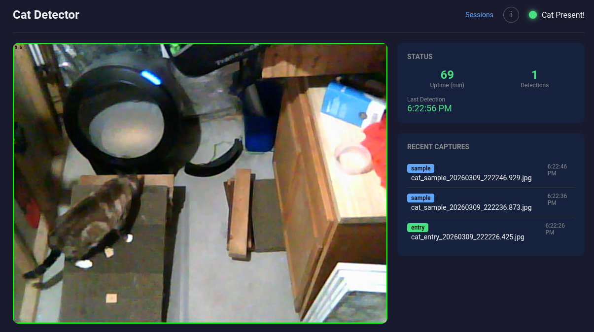
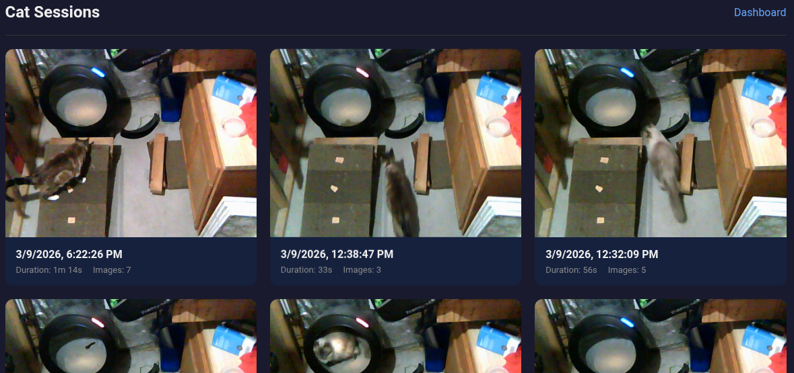
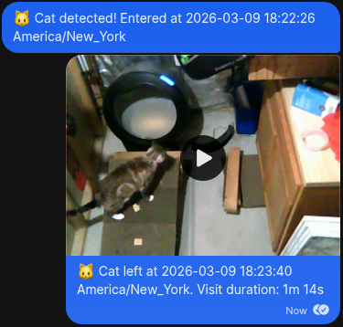

# Cat Detector

[](https://github.com/griswaldbrooks/cat-detector/actions/workflows/ci.yml)

A Rust application that monitors a USB webcam for cats using CLIP ViT-B/32 zero-shot classification. Saves images on cat entry/exit, records video of visits, sends Signal notifications, and serves a web dashboard with live MJPEG stream.



## Features

- Real-time cat detection using CLIP ViT-B/32 (zero-shot, ~21ms on CPU)
- Hysteresis-based tracking to avoid false triggers
- Automatic image capture on cat entry/exit and periodic samples
- Video recording of cat visits (FFmpeg H.264 MP4)
- Signal messenger notifications with video attachments
- Web dashboard with live MJPEG stream and session browsing
- Runs as a CLI daemon or systemd service
- Fully configurable via TOML

## Requirements

- Linux (tested on Ubuntu 22.04+)
- USB webcam (V4L2 compatible)
- Rust 1.92+ (for building)
- ONNX Runtime 1.23.2
- FFmpeg (for video recording)

## Quick Start

### 1. Install Build Dependencies

```bash
sudo apt install libv4l-dev ffmpeg
```

### 2. Build

```bash
cargo build --release --features real-camera,web
```

### 3. Set Up ONNX Runtime

Download from [ONNX Runtime releases](https://github.com/microsoft/onnxruntime/releases/tag/v1.23.2):

```bash
curl -L -o ort.tgz https://github.com/microsoft/onnxruntime/releases/download/v1.23.2/onnxruntime-linux-x64-1.23.2.tgz
tar xzf ort.tgz && mv onnxruntime-linux-x64-1.23.2 onnxruntime && rm ort.tgz
```

### 4. Set Up Models

The CLIP text embeddings are tracked in the repo. Download the CLIP image encoder:

```bash
# Download CLIP ViT-B/32 image encoder from HuggingFace
# Place at models/clip_vitb32_image.onnx
```

### 5. Configure and Run

```bash
cp config.example.toml config.toml
# Edit config.toml with your settings

ORT_DYLIB_PATH=./onnxruntime/lib/libonnxruntime.so ./target/release/cat-detector run --config config.toml
```

## Configuration

See `config.example.toml` for all available options. Key settings:

| Section | Option | Description |
|---------|--------|-------------|
| camera | device_path | Webcam device (`"auto"` to auto-detect) |
| detector | model_path | Path to CLIP ONNX model |
| detector | confidence_threshold | Detection confidence (0.0-1.0) |
| storage | output_dir | Where to save captured images |
| notification | enabled | Enable Signal notifications |
| notification | recipient | Phone number for notifications |
| tracking | enter_threshold | Detections needed to confirm entry |
| tracking | exit_threshold | Non-detections needed to confirm exit |

## Web Dashboard

When built with the `web` feature, serves a dashboard at `http://localhost:8080`:

- `/` -- Live MJPEG stream with detection overlay and system info
- `/sessions` -- Browse cat visit sessions with images and video
- `/captures/:filename` -- Direct image/video access
- `/api/system-info` -- JSON system info

| Sessions | Signal Notification |
|---|---|
|  |  |

## CLI Commands

```
cat-detector run                Run the detector daemon
cat-detector test-image IMAGE   Test detection on an image file
cat-detector test-camera        Capture and detect from camera
cat-detector test-notification  Send a test Signal notification
cat-detector install-service    Install as systemd service
cat-detector uninstall-service  Remove systemd service
cat-detector status             Show service status
```

## Detection Model

Uses CLIP ViT-B/32 for zero-shot classification with three text prompts: "a photo of a cat", "a photo of an empty room", and "a photo of a person". This approach was chosen over YOLO object detection models after benchmarking showed CLIP achieves 100% detection accuracy on overhead views while YOLO models maxed out at ~23%. See [`docs/model-evaluation.md`](docs/model-evaluation.md) for the full comparison.

## Development

```bash
# Unit tests (no external deps)
cargo test --lib

# Integration tests (needs CLIP model + ORT runtime)
ORT_DYLIB_PATH=./onnxruntime/lib/libonnxruntime.so cargo test --test clip_integration_test

# Lint
cargo clippy --all-features -- -D warnings
cargo fmt --check
```

## Deployment

See [`docs/deployment.md`](docs/deployment.md) for the full deployment guide including systemd setup, signal-cli configuration, and permissions.

## License

MIT
